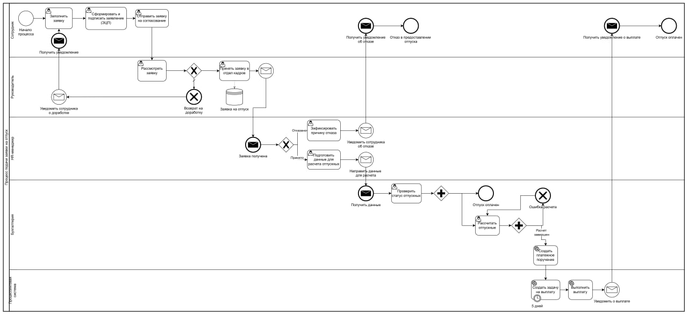

# BPMN: Планирование отпуска

В данном разделе представлена BPMN-диаграмма процесса **«Планирование отпуска»**.

Диаграмма отражает полный бизнес-процесс оформления отпуска: от создания заявки сотрудником до расчёта и выплаты отпускных, включая взаимодействие руководителя, HR, бухгалтерии и смежных информационных систем.

## Диаграмма

