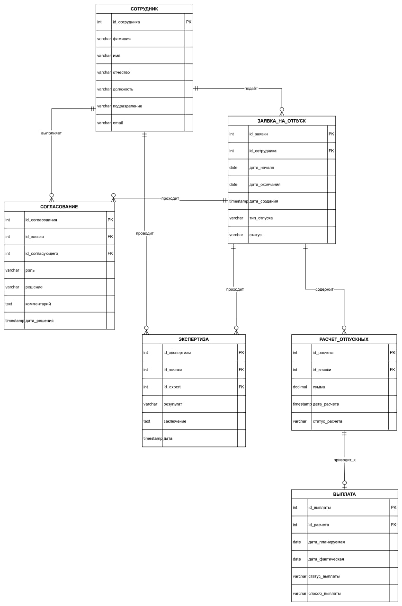

# Database Design

В данном разделе представлена логическая ER-модель базы данных модуля **«Отпуск»**.

Модель включает основные сущности, их атрибуты, связи между ними, а также первичные и внешние ключи.

## ER Diagram

