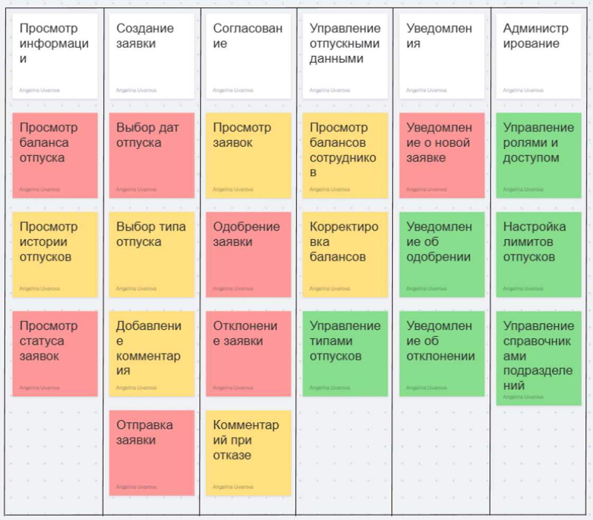

# User Story Map

В данном разделе представлена User Story Map для модуля **«Отпуск»** системы **«Альфа-Персонал»**.

Карта пользовательских историй была составлена на основе функциональных требований, Use Case и бизнес-процесса BPMN. Для приоритизации использован метод **MoSCoW**, а обязательная функциональность первого релиза выделена как **MVP**.

## Пользовательские истории

### Сотрудник

| User Story |
|------------|
| Как сотрудник, я хочу видеть текущий баланс дней отпуска, чтобы понимать, сколько дней я могу взять. |
| Как сотрудник, я хочу просматривать историю моих отпусков, чтобы видеть ранее использованные дни. |
| Как сотрудник, я хочу видеть статус своей заявки, чтобы понимать, на каком этапе находится процесс. |
| Как сотрудник, я хочу выбирать даты начала и окончания отпуска, чтобы сформировать заявку. |
| Как сотрудник, я хочу выбирать тип отпуска, чтобы корректно оформить заявку. |
| Как сотрудник, я хочу добавлять комментарий к заявке, чтобы уточнить детали. |
| Как сотрудник, я хочу отправлять заявку на согласование, чтобы начать процесс оформления отпуска. |
| Как сотрудник, я хочу получать уведомления об одобрении или отклонении заявки. |

### Руководитель

| User Story |
|------------|
| Как руководитель, я хочу видеть список заявок сотрудников, чтобы своевременно их согласовывать. |
| Как руководитель, я хочу видеть график отпусков команды, чтобы планировать загрузку отдела. |
| Как руководитель, я хочу видеть историю согласований по заявке, чтобы анализировать изменения. |
| Как руководитель, я хочу утверждать заявку на отпуск. |
| Как руководитель, я хочу отклонять заявку с комментарием, чтобы объяснить причину отказа. |
| Как руководитель, я хочу получать уведомления о новых заявках. |

### HR

| User Story |
|------------|
| Как HR, я хочу видеть список всех заявок, чтобы контролировать процесс оформления отпусков. |
| Как HR, я хочу видеть статистику отпусков по отделам. |
| Как HR, я хочу изменять статус заявки после согласования. |
| Как HR, я хочу корректировать даты отпуска при необходимости. |
| Как HR, я хочу получать уведомления о согласованных заявках. |

## Приоритизация (MoSCoW)

| Приоритет | Функциональность |
|-----------|------------------|
| **Must Have (MVP)** | Просмотр баланса отпуска, просмотр статуса заявки, выбор дат отпуска, отправка заявки, одобрение заявки, отклонение заявки, уведомление о новой заявке |
| **Should Have** | Просмотр истории отпусков, выбор типа отпуска, добавление комментария, просмотр заявок, комментарий при отказе, просмотр балансов сотрудников, корректировка балансов |
| **Could Have** | Управление типами отпусков, уведомления об одобрении и отклонении, управление ролями и доступом, настройка лимитов отпусков, управление справочниками подразделений |
| **Would have** | - |

## Диаграмма

